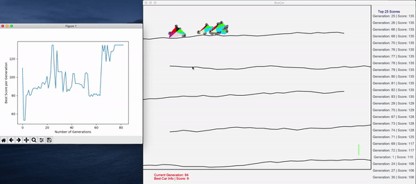
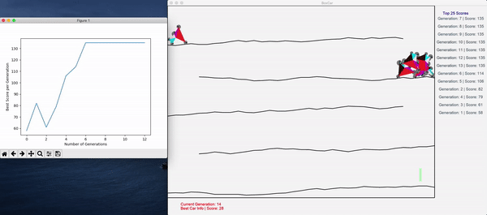

# Demo GIFs

Making changes in the constants.py file can result in different simulations.
Below are a couple of examples.

## Constants
REWARD = 20
TERRAIN_FRICTION = 1
CHASSIS_FRICTION = 0.

## Constants
REWARD = 10
TERRAIN_FRICTION = 0.6
CHASSIS_FRICTION = 0.2

