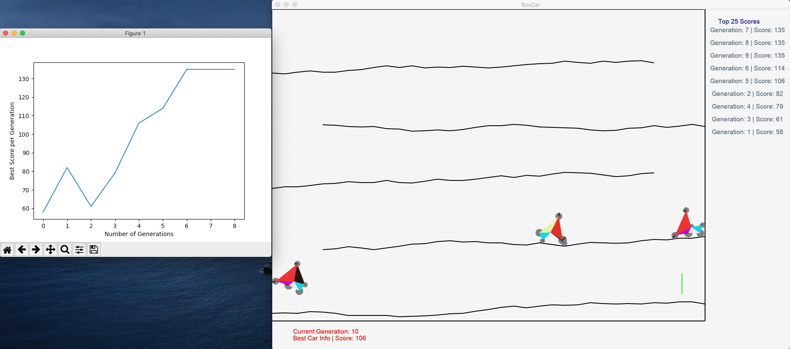

# PyBoxCar
A BoxCar2D implementation in Python. The aim of the cars in this simulation is to start from the top left corner and reach the goal at the bottom right, as quickly as possible. The Genetic Algorithm is used to optimize the cars after every generation.

## Demo

You can check out the GIFs from the simulation [here.](GIFs.md)



## Getting Started
Python 3.6+

(Arcade runs on Windows, Mac OS X, and Linux. Arcade requires Python 3.6 or newer. It does not run on Python 2.x though Pymunk runs on both versions of python.)

 ### Installing
 You will only need to install the arcade and pymunk libraries for graphics and physics simulation.
Matplotlib is used to plot the best score across generations to provide a fair idea about the performance of the model.

More information on  [arcade](https://arcade.academy/installation.html)  here.

More information on  [pymunk](http://www.pymunk.org/en/latest/installation.html)  here.

More information on [matplotlib](https://matplotlib.org/3.1.0/index.html) here.

```
pymunk==5.6.0
arcade==2.3.10
matplotlib==3.2.1
```
I've included them in requirements.txt

## License
This project is licensed under the MIT License - see the [LICENSE.md](LICENSE.md) file for details.

## References
* [The Original Implementation](http://boxcar2d.com/)
* [Another HTML Implementation](https://rednuht.org/genetic_cars_2/)
* [A Genetic Algorithm Playlist](https://www.youtube.com/watch?v=9zfeTw-uFCw&list=PLRqwX-V7Uu6bJM3VgzjNV5YxVxUwzALHV)
